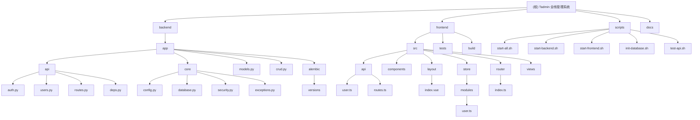

# CLAUDE.md

This file provides guidance to Claude Code (claude.ai/code) when working with code in this repository.

## 变更记录 (Changelog)

### 2025-11-09 22:13:52 - 自适应初始化架构师系统
- 执行全仓扫描和模块识别
- 生成Mermaid架构图和模块导航
- 创建模块级CLAUDE.md文档
- 建立覆盖率度量和续跑机制

## 项目概述

**Tadmin** 是一个基于现代技术栈构建的全栈管理系统（全栈开发脚手架），采用前后端分离架构，提供完整的用户认证、权限管理和数据管理功能。该项目非常适合用作开发其他应用的模版，开箱即用。

## 架构总览

### 模块结构图



## 技术栈

### 后端

- **框架**: FastAPI 0.114+
- **语言**: Python 3.10+
- **数据库**: SQLite (开发) / PostgreSQL (生产)
- **ORM**: SQLModel
- **认证**: JWT (Access Token + Refresh Token)
- **迁移**: Alembic
- **包管理**: uv

### 前端

- **框架**: Vue 3.5+ + TypeScript 5.8+
- **UI库**: Element Plus 2.10+
- **构建**: Vite 7.0+
- **状态**: Pinia 3.0+
- **路由**: Vue Router 4.5+
- **样式**: Tailwind CSS 4.1+
- **包管理**: pnpm
- **E2E测试**: Playwright

## 模块索引

| 模块路径 | 语言 | 主要职责 | 入口文件 | 测试覆盖 | 配置文件 |
|---------|------|----------|----------|----------|----------|
| [backend](./backend/CLAUDE.md) | Python | FastAPI后端服务 | `app/main.py` | 单元测试 | `pyproject.toml` |
| [frontend](./frontend/CLAUDE.md) | TypeScript | Vue3前端界面 | `src/main.ts` | Playwright E2E | `package.json` |
| [scripts](./scripts/CLAUDE.md) | Shell | 运维脚本 | `start-all.sh` | - | - |
| [docs](./docs/CLAUDE.md) | Markdown | 项目文档 | `README.md` | - | - |

## 运行与开发

### 使用项目脚本（推荐）

根据项目规则，所有 Run & Debug 操作都应该使用 `scripts/` 目录下的脚本：

```bash
# 初始化数据库
./scripts/init-database.sh

# 启动完整系统
./scripts/start-all.sh

# 分别启动服务
./scripts/start-backend.sh    # 后端: http://localhost:8000
./scripts/start-frontend.sh   # 前端: http://localhost:8848

# API 测试
./scripts/test-api.sh
```

### 后端命令

```bash
cd backend
# 依赖管理
uv sync                    # 安装依赖
uv run uvicorn app.main:app --reload --host 0.0.0.0 --port 8000  # 开发服务器

# 数据库迁移
uv run alembic revision --autogenerate -m "描述变更内容"
uv run alembic upgrade head

# 代码质量
uv run ruff check          # 代码检查
uv run ruff format         # 代码格式化
```

### 前端命令

```bash
cd frontend
pnpm install               # 安装依赖
pnpm dev                   # 开发服务器
pnpm build                 # 生产构建
pnpm lint                  # 代码检查和格式化
pnpm typecheck             # 类型检查

# Playwright E2E测试
pnpm test:e2e              # 运行E2E测试
pnpm test:e2e:ui           # UI模式测试
pnpm test:e2e:debug        # 调试模式测试
pnpm test:e2e:codegen      # 代码生成器
```

## 测试策略

### 后端测试
- **单元测试**: 使用 pytest 进行业务逻辑测试
- **API测试**: 使用 httpx 进行接口测试
- **数据库测试**: 使用 SQLite 内存数据库

### 前端测试
- **E2E测试**: 使用 Playwright 进行端到端测试
- **测试环境**: `http://localhost:8848`
- **测试覆盖**: 登录、用户管理、权限控制等核心功能

## 编码规范

### Python后端规范
- **代码检查**: Ruff (替代 pylint + black)
- **类型检查**: MyPy (严格模式)
- **代码风格**: 遵循 PEP 8，行数限制 300 行
- **文档字符串**: 使用 Google 风格

### TypeScript前端规范
- **代码检查**: ESLint + Prettier
- **样式检查**: Stylelint
- **类型安全**: 严格 TypeScript 模式
- **代码规范**: Vue 3 Composition API 优先

## AI 使用指引

### 开发建议
1. **优先阅读模块文档**: 在修改代码前，先查看对应模块的 CLAUDE.md
2. **遵循脚本约定**: 所有启停操作必须使用 scripts/ 目录脚本
3. **保持类型安全**: 前端强类型，后端使用 SQLModel 类型约束
4. **测试驱动**: 新功能需要包含相应的测试用例

### 调试技巧
- **后端调试**: 检查 `/docs` 接口文档和日志输出
- **前端调试**: 使用 MCP Playwright 实时浏览器调试
- **数据库调试**: 查看 Alembic 迁移文件和 SQLite 数据库

## 默认配置

### 管理员账号
- **邮箱**: admin@example.com
- **用户名**: admin
- **密码**: admin123

### 服务地址
- **前端**: http://localhost:8848
- **后端 API**: http://localhost:8000
- **API 文档**: http://localhost:8000/docs

### 环境变量
```bash
DATABASE_TYPE=sqlite          # 数据库类型: sqlite/postgresql
SECRET_KEY=your-secret-key    # JWT密钥
ACCESS_TOKEN_EXPIRE_MINUTES=30  # 访问令牌过期时间
```

## 项目特性

1. **智能环境配置**: 自动根据环境选择数据库
2. **完整工具链**: 从开发到部署的全套脚本
3. **严格质量控制**: 多层代码检查
4. **脚本化运维**: 必须使用 scripts/ 目录脚本
5. **现代化架构**: 最新技术栈和最佳实践
6. **E2E测试支持**: 集成Playwright自动化测试
7. **调试友好**: 支持MCP Playwright实时调试

## 重要提醒

- **永远使用 scripts/ 目录下的脚本进行启停**，不要直接使用 npm、pnpm、uv、python 等命令
- Python 虚拟环境使用 `.venv` 目录名
- 优先使用 TypeScript，强类型数据结构
- 遵循代码文件行数限制（动态语言 300 行，静态语言 400 行）
- 注意代码架构的优雅性，避免"坏味道"模式

## 调试指南

### MCP Playwright调试
项目集成了MCP Playwright调试工具，支持实时浏览器调试：

```bash
# 启动前端服务
./scripts/start-frontend.sh

# 使用MCP Playwright调试
mcp__playwright__browser_navigate "http://localhost:8848"
mcp__playwright__browser_snapshot
mcp__playwright__browser_click "元素描述" "ref引用"
```

### 常见问题调试
1. **Token刷新错误**: 检查frontend/src/utils/http/index.ts中refresh_token参数传递
2. **UI视口问题**: 使用JavaScript直接操作DOM元素绕过视口限制
3. **网络请求监控**: 使用mcp__playwright__browser_network_requests查看API调用

*基于项目现有 CLAUDE.md 和 README 文件整合更新*
- 文档更新制度
必须立即更新的情况
Git commit - 处理完成后立即记录到CHANGELOG.md
系统架构调整 - 结构调整后更新CLAUDE.md和CHANGELOG.md
新增Commands - 新Command创建后添加到CLAUDE.md
重要配置变更 - 任何核心配置修改都要记录